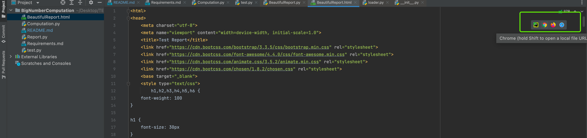

# BigNumberComputation
This project is going to perform computation on big numbers. And the function also can be used to calculate the ordinary numbers.
The  repo link : https://github.com/jingjing85/BigNumberComputation.git
If you have any question, please feel free to contact me.
Execution step：
1. Run Computation.py
2. input two big numbers(For testing easily, if the length of the number is lager than or equal 20, they are big numbers) 
3. their sum and difference and product will be output
4. BeautifulReport.html is the result of the Unit test. And you can open it through browser,  please prefer to the picture img.png. 